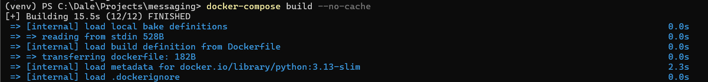
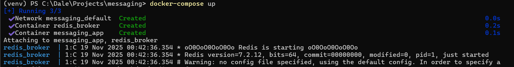
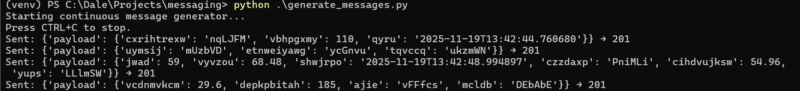
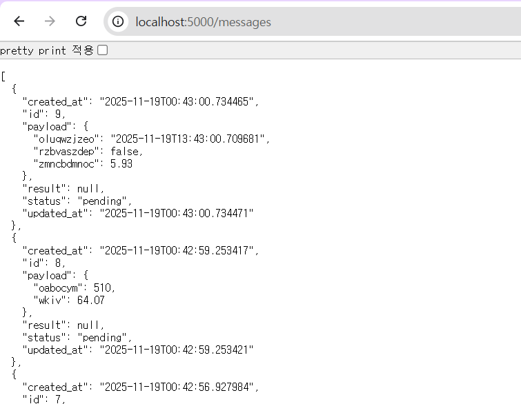
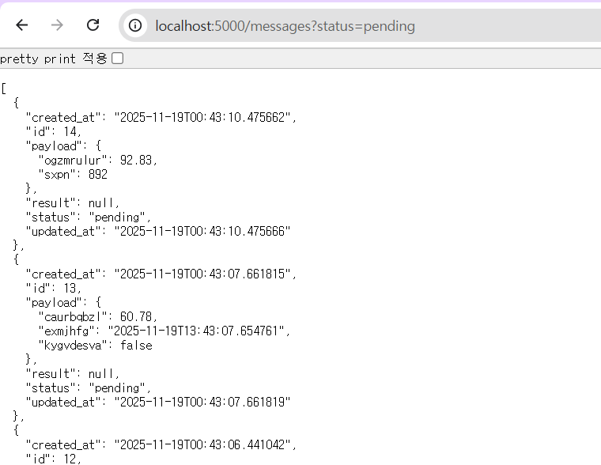
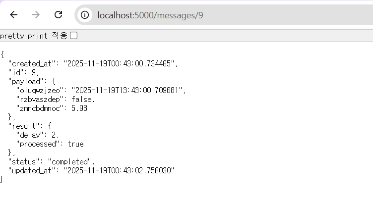
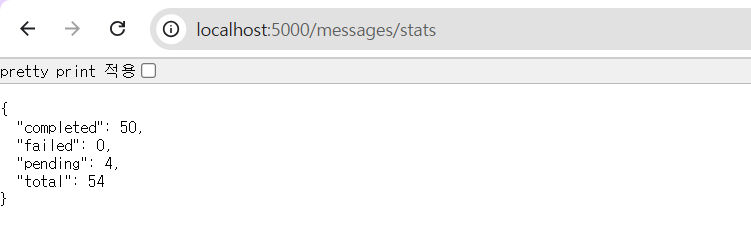

# Message Processing System
A fully containerized message-processing system built with **Flask**,
**Celery**, **Redis**, and **SQLite**. Messages are submitted through a
REST API, stored in the database, processed asynchronously by Celery
workers, and retrieved via the API.

> **Tested and implemented on Windows 11 Pro**

# Setup
## 1. Install Python
1. Go to [Python Download](https://www.python.org/downloads)
2. Download Python 3.13.x and install
3. Verify installation
   ```
   python --version
   ```

## 2. Download Source Code
```
git clone https://github.com/isbicf/messaging.git
```

## 3. Create a Virtual Environment
```
python -m venv venv
```

## 4. Install Dependencies
```
python -m pip install --upgrade pip
pip install -r requirements.txt
```

## 5. Install Docker
1. Go to [Docker Desktop Download](https://www.docker.com/products/docker-desktop/)
2. Download installer for **Windows – AMD64** vresion and install
3. Confirm installation
   ```
   docker --version
   docker compose version
   ```

# Testing
1. Start Docker Desktop
2. Build containers
   ```
   docker-compose build --no-cache
   ```
   
3. Run
   ```
   docker-compose up
   ```
   
4. Test POST /messages
   ```
   python generate_messages.py
   ```
   
5. Test GET /messages
   ```
   http://localhost:5000/messages
   ```
   
6. Test GET /messages?status 
   ```
   http://localhost:5000/messages?status=pending
   ```
   
7. Test GET /messages/<id>
   ```
   http://localhost:5000/messages/9
   ```
   
8. Test GET /messages/stats
   ```
   http://localhost:5000/messages/stats
   ```
   
